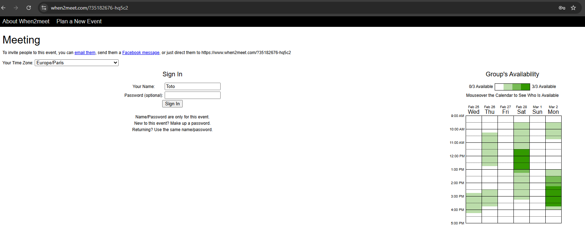
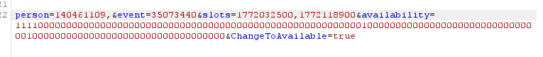
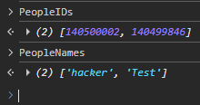
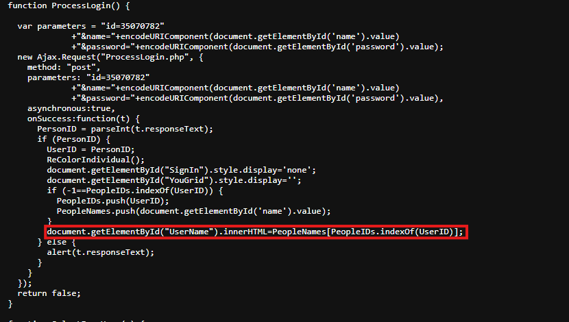
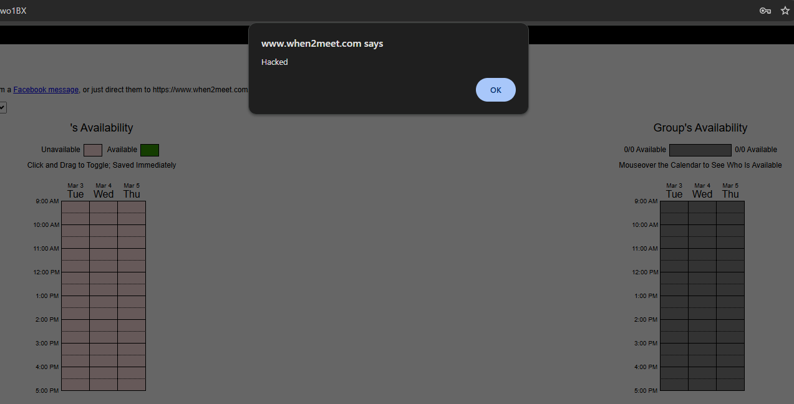
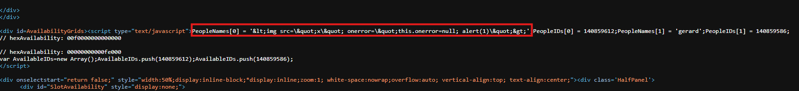
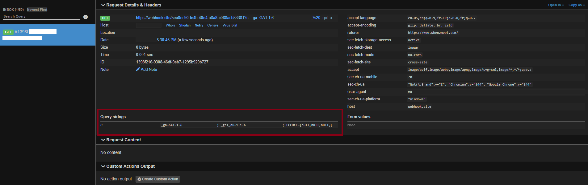

[When2meet.com](https://www.when2meet.com/) is a popular tool for coordinate scheduling. While it offers an optional password feature to "protect" user profiles, the underlying architecture lacks robust server-side enforcement, leading to significant impersonation and injection risks.



<!-- truncate -->

# IDOR

The POST request to `SaveTimes.php` relies exclusively on the `person` (User ID) and `event` parameters. Because no session token or password hash is required in the API call, an attacker can modify the `person` ID to overwrite the availability of any other participant.



Since participant IDs are visible in the client-side source code, an attacker can:

- Impersonate any user to alter their schedule.
- Sabotage event planning by clearing or filling others' availability.
- Automate "Account Takeovers" for specific events using simple scripts.

The lack of proper security check and Peoples ID being availble client side enable anyone to impersonate any user which could lead to organisation issue and enable an attacker to mess with the planification.




# Self-XSS & HTML Injection

The application utilizes innerHTML to render user-provided names, creating an opening for Cross-Site Scripting (XSS).



By injecting a payload into the name field, an attacker can execute arbitrary JavaScript within their own session context.

```PlainText

```



While the platform appears to sanitize inputs before displaying them to other users (mitigating Stored XSS), the Self-XSS remains a high-value vector for social engineering.



An attacker could use "Copy-Paste" schemes, convincing a victim to paste a malicious string into their own name field under the guise of "unlocking features" or "customizing themes", to exfiltrate session cookies or redirect the user to a phishing site.


```PlainText

```




Beyond simple data exfiltration, an attacker can leverage this injection to perform UI Redressing. By mimicking legitimate third-party integrations—such as an 'Sync with Outlook' prompt—the attacker can deceive users into surrendering their Microsoft credentials or authorizing malicious OAuth applications. This transforms a simple client-side injection into a sophisticated gateway for credential harvesting and broader account compromise. 


